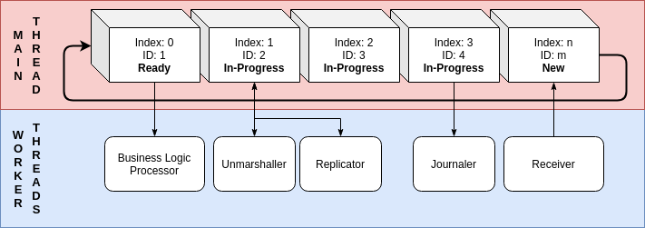

# plancks

Plancks is a high performance in-memory message bus

## Stability

Experimental

## Branching Strategy

[Trunk Based Development](https://trunkbaseddevelopment.com/)

## Problem Statement

Producer and consumer message bus complexity can lead to loss in performance and a convoluted architecture with high resource costs.

## Architecture

Plancks follows in the footsteps of the bold [LMAX-Exchange](https://github.com/LMAX-Exchange/) engineering team with heavy reliance on the research and development efforts to produce their open source [Disruptor Project](https://github.com/LMAX-Exchange/disruptor/). 

Concurrency is managed, preserving order, with a ring buffer allowing for wildly high throughput of event processing with unparalleled consumption latency.

Plancks is the message bus that allows multi-threaded applications to intelligently utilize system resources.

## License

MIT
